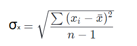
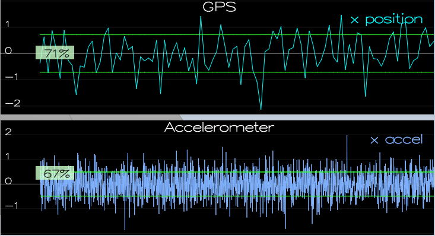
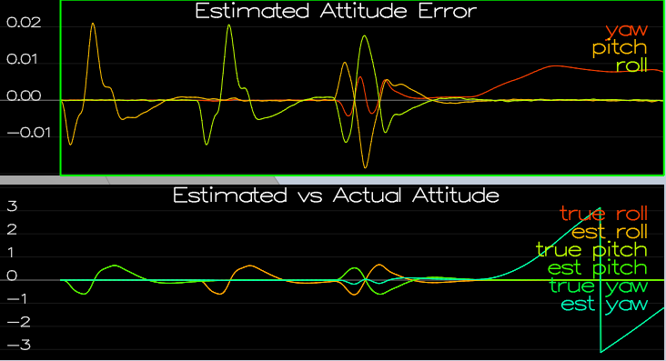
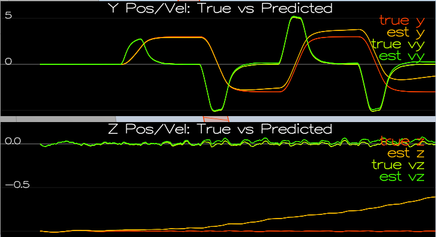
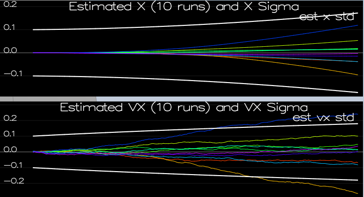
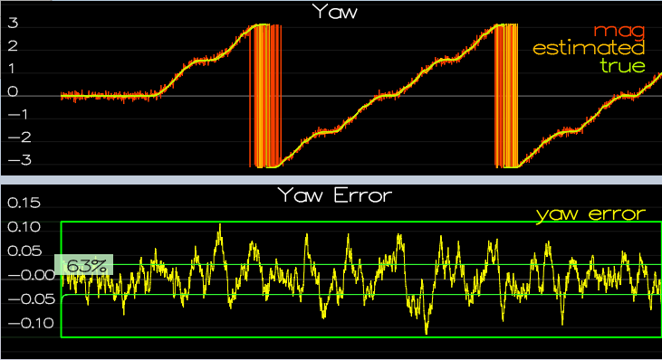

# Implement Estimator

## Determine Standard Deviation Of Measurement Noise For GPS X And Accelerometer X Data
Calculated the sample standard deviation according to:

Note that for calculation, sample standard deviation was used (denominator: n-1) instead of population standard deviation (denominator: n) since the underlying data was sampled and since the sample standard deviation is more conservative (larger standard deviation).

To determine the following values, implemented the equation above in Excel.  Note that Excel's STDEV.S was not used; the equation above was implemented without using any of Excel's built-in statistics functions.

Calculated values:
* MeasuredStdDev_GPSPosXY = 0.714619
* MeasuredStdDev_AccelXY = 0.489301

The calculated standard deviations captured ~68% of the sensor measurements:

## Implement Better Rate Gyro Attitude Integration Scheme In UpdateFromIMU()

Used quaternions to improve the gyro attitude integration.  See QuadEstimatorEKF.cpp - UpdateFromIMU(), especially lines 102-112.

The improved integration scheme resulted in estimated attitude error < 0.1 rad for each of the Euler angles for at least 3 seconds:

## Implement All Elements Of The Estimator Prediction Step

All line references below are to QuadEstimatorEKF.cpp:
* State update element - See PredictState(), especially lines 171-182
* Rgb prime matrix - See GetRbgPrime(), especially lines 210-220
* State covariance update - See Predict(), especially lines 258-274 (line 274 is the classic EKF update equation)
    * Acceleration is accounted for as a command in the calculation of gPrime (lines 269-271)

## Implement Magnetometer Update

Incorporated magnetometer data into the state.  See QuadEstimatorEKF.cpp - UpdateFromMag(), especially lines 327 - 334
* Angle error between the current state and the magnetometer value is calculated the "short" way (i.e. constrained within [-PI, PI])

## Implement GPS Update

Incorporated GPS information to update the current state estimate.  See QuadEstimatorEKF.cpp - UpdateFromGPS(), especially lines 283-289 and 300 - 304

# Flight Evaluation

## Meet Performance Criteria - Provided Controller

Met the performance criteria for each step of the project with the provided controller.

* Scenario 6 - Sensor Noise
    * See above
* Scenario 7 - Attitude Estimation
    * See above
* Scenario 8 - Predict State
    * 
        * There are no performance criteria for this scenario, but the results shown above are as expected, i.e. good position and velocity tracking with drift over time.
* Scenario 9 - Predict Covariance
    * 
        * There are no performance criteria for this scenario, but the results shown above are as expected, i.e. sigmas largely bound estimated states.
* Scenario 10 - MagUpdate
    * 
* Scenario 11 - GPS Update
    * ")
        * < 1 m error for entire box flight
 
 ## Meet Performance Criteria - My Controller
 * Scenario 11 - GPS Update
    * ")
        * De-tuned my controller from the 'Building A Controller' project to successfully fly the final desired box trajectory with my estimator and realistic sensors.
        * < 1 m error for entire box flight
